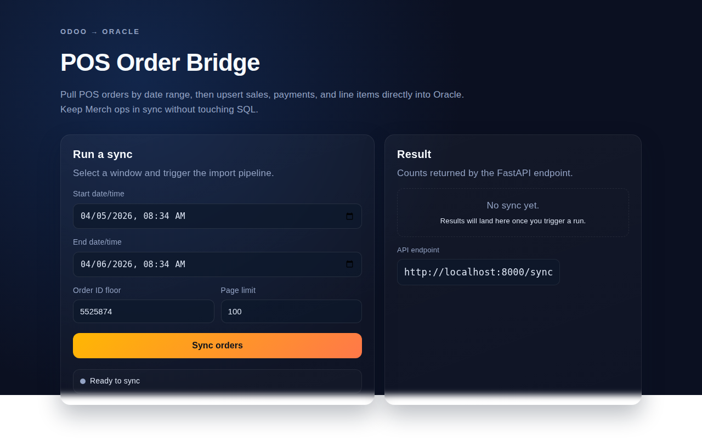
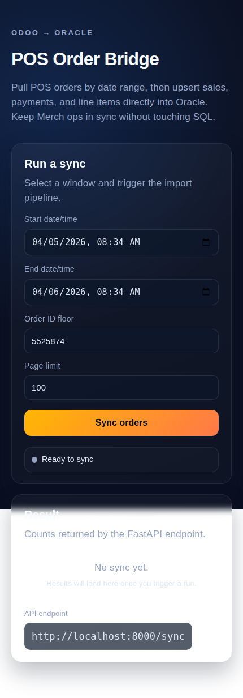

# POS Order Sync (Odoo → Oracle)

Full-stack app that pulls POS order data from the provided Odoo API and upserts it into three Oracle tables. The backend uses FastAPI; the frontend is a lightweight Vite/React UI for triggering syncs by date range.

## Prerequisites
- Python 3.10+ with `pip`
- Node 18+ with `npm`
- Oracle network access and privileges to write to `ODOO_INTEGRATION.TEST_BACKUP_VENDHQ_SALES`, `ODOO_INTEGRATION.TEST_BACKUP_VENDHQ_PAYMENTS`, and `ODOO_INTEGRATION.TEST_BACKUP_VENDHQ_LINE_ITEMS`
- Odoo API key

## Backend (FastAPI + Oracle)
1. Create a virtualenv and install dependencies:
   ```bash
   python -m venv .venv
   source .venv/bin/activate
   pip install -r backend/requirements.txt
   ```
2. Copy `.env.example` to `.env` and fill values (API key and Oracle password are required):
   ```env
   ODOO_API_URL=https://ibrahimalquraishieu-26-2-26-29083802.dev.odoo.com/api/pos/order
   ODOO_API_KEY=<your-api-key>
   ODOO_ORDER_MIN_ID=5525874
   ORACLE_HOST=193.122.68.27
   ORACLE_PORT=1521
   ORACLE_SERVICE=TestDB_jed1sw.dbsubnet.testvcn.oraclevcn.com
   ORACLE_USER=SYS
   ORACLE_PASSWORD=<oracle-password>
   ORACLE_MODE=SYSDBA
   ALLOWED_ORIGINS=["http://localhost:5173"]
   ```
3. Run the API:
   ```bash
   uvicorn app.main:app --app-dir backend --host 0.0.0.0 --port 8000 --reload
   ```

### Sync endpoint
`POST /sync`
```json
{
  "start_date": "2026-02-01T00:00:00",
  "end_date": "2026-02-02T23:59:59",
  "order_id_gt": 5525874,
"limit": 100
}
```
- Fetches Odoo POS orders (paged, ordered ascending by id) and upserts into the three Oracle tables.
- Customer type rules: contains `WC-` → `WHOLESALE`, contains `VIP` → `VIP`, otherwise `NORMAL`.
- Line items: calculates discount from percentage, uses `OUTPUT-GOODS-DOM-15%` as tax name, sets `INV_UPLOAD_QNT_FLAG` to `Y` when the item name contains `TOBACCO`.
- Response now includes per-table sync reports, retry batches for any rows Oracle rejected, and the Oracle connection target/user:
  ```json
  {
    "orders_fetched": 10,
    "sales_upserted": 10,
    "payments_upserted": 10,
    "line_items_upserted": 24,
    "sales_report": {
      "attempted": 10,
      "upserted": 10,
      "missing_row_ids": [],
      "retry_batches": [],
      "errors": []
    },
    "payments_report": { "...": "..." },
    "line_items_report": { "...": "..." },
    "data_integrity_ok": true,
    "oracle": {
      "connected": true,
      "target": "193.122.68.27:1521/TestDB_jed1sw.dbsubnet.testvcn.oraclevcn.com",
      "user": "SYS"
    }
  }
  ```
- If Oracle rejects any rows (for example, due to performance timeouts), the `retry_batches` field lists row IDs that can be retried separately to guarantee 100% coverage.

Health check: `GET /health` reports Oracle connectivity, target descriptor, and API key presence.

## Frontend (Vite + React)
1. Configure the API base URL:
   ```bash
   cp frontend/.env.example frontend/.env
   # Adjust VITE_API_BASE_URL if the backend is not at http://localhost:8000
   ```
2. Install dependencies and run:
   ```bash
   cd frontend
   npm install
   npm run dev
   ```
3. The UI lets you pick a start/end datetime, an optional order-id floor, and page size. It calls the FastAPI `/sync` endpoint and shows returned counts.

## UI preview




## Validation
- Frontend: `cd frontend && npm run build`
- Backend: there are no automated tests yet; after installing requirements you can sanity check syntax with `python -m compileall backend`.
